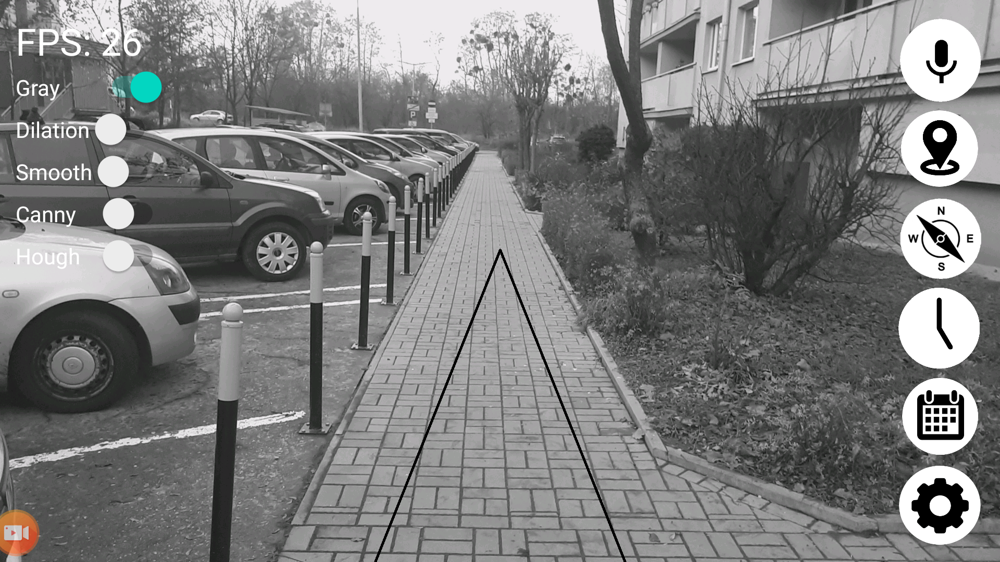
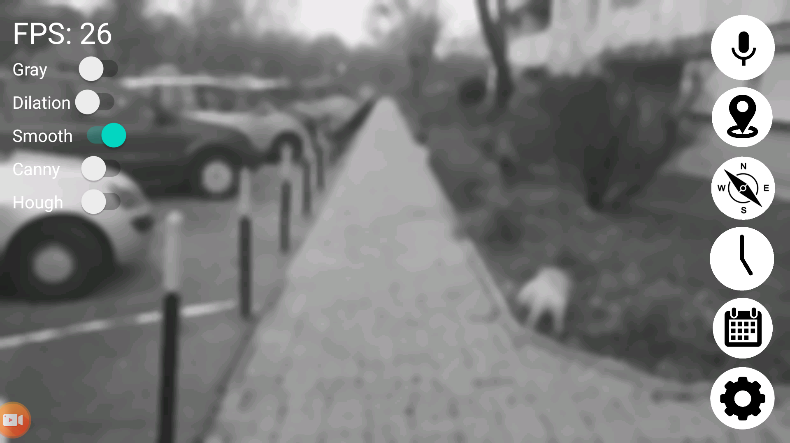
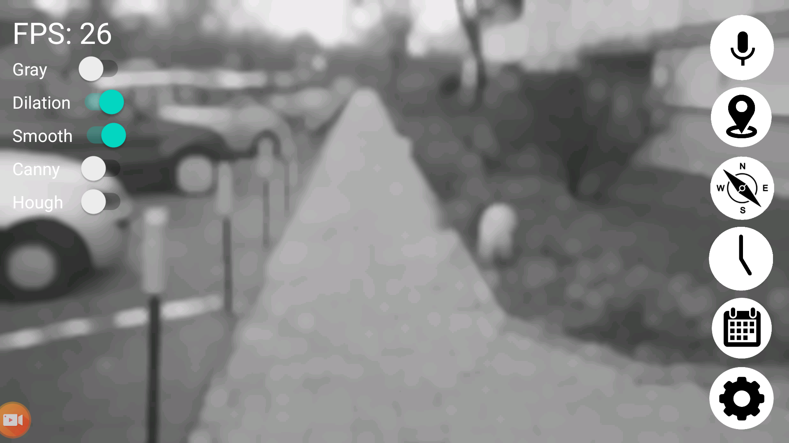
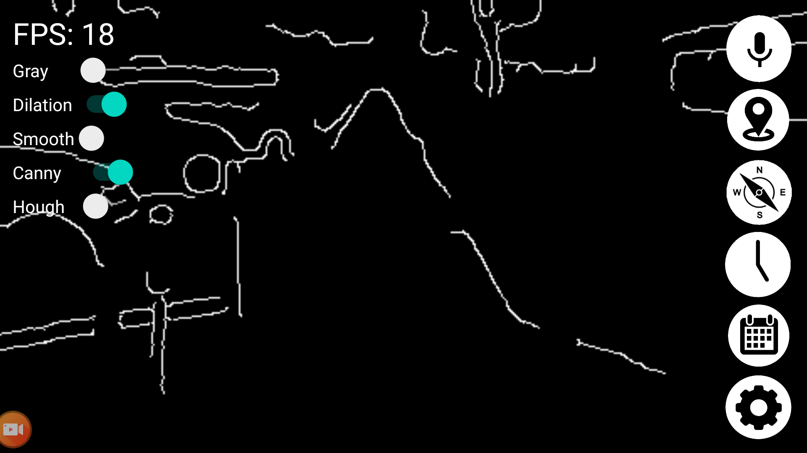
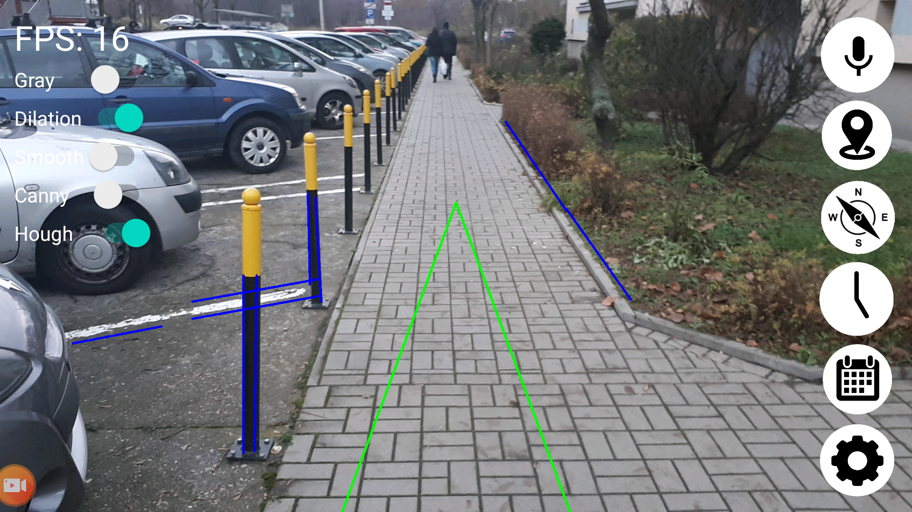
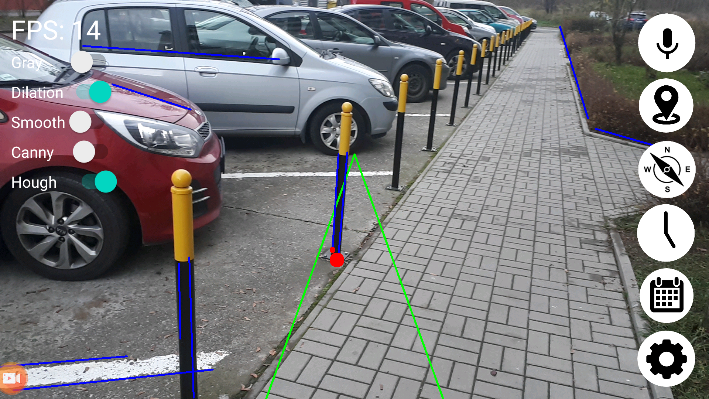
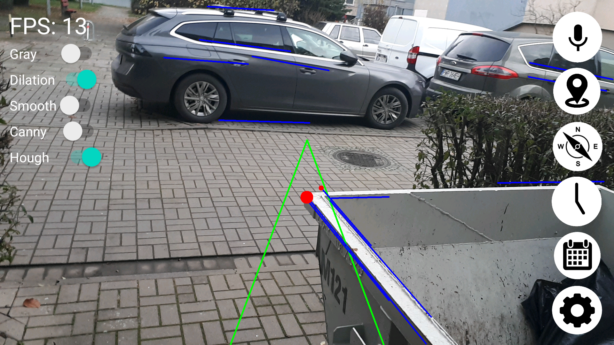
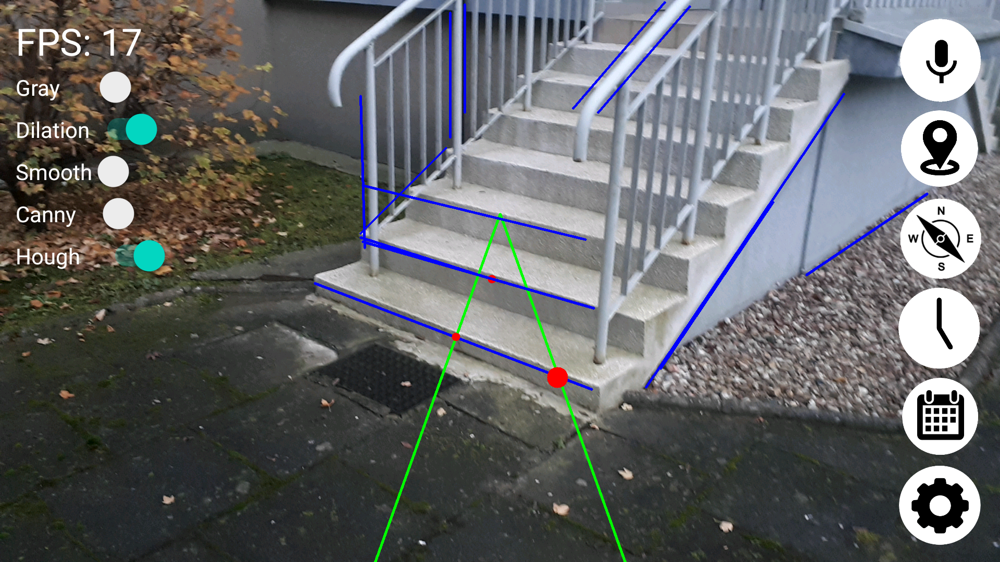
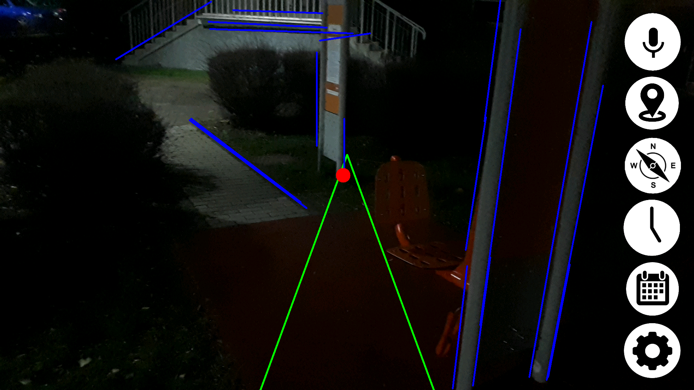
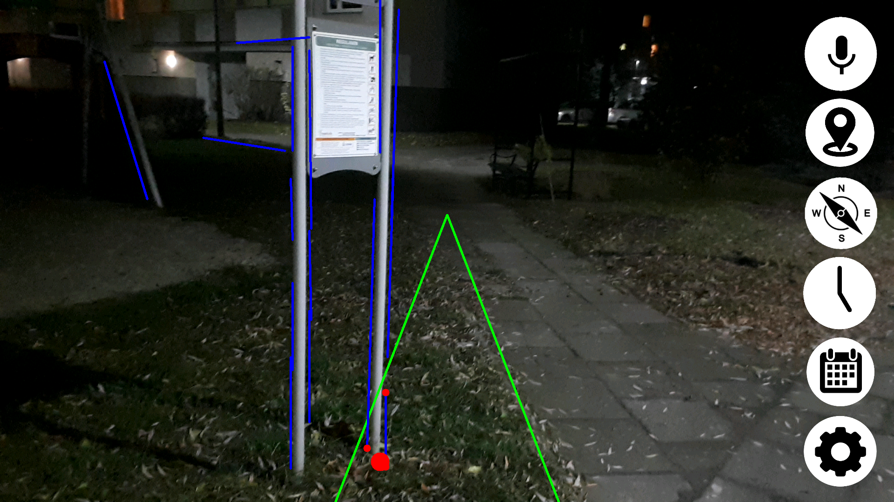

# Navigation For Blind
This application is part of my engineering thesis called "Mobile application for blind people to help them navigate through the city".

The obstacle detection algorithm:
 1. Transform RGB to Gray image.
 2. Reduce image size to around 500x400. (the bigger the better results but worse performance)
 3. Apply median filter 5x5.
 4. Apply avg blur filter 5x5.
 5. Dilation 5x5- enlargment of brighter pixels and shrinking of darker ones. It serves a role of erasing dark edges occuring on the pavement between paving blocks.
 6. Apply median filter 5x5.
 7. Canny edge detection with adaptive min and max thresholds according to average image brightness -> Min=(1-0.33)*avg, Max=(1+0.33)*avg
 8. Probabilistic Hough Lines transform for lines detection. rho: 1.0, theta: Math.PI / 180, threshold: 40, minLineLength: 40.0, maxLineGap: 10.0)
 9. Detecting intersections between detected obstacle lines and our field of detection.
 10. Average closest intersection point from last frame and current frame.
 11. Make stereo sound (depending on intersection position left and right headphone volume is adjusted) with loudness according to intersection relative distance (the higher the intersection occurred on the screen the further it should be)

Algorithm visualisation:

Convert to gray image.

After median and avg blur 5x5.

Dilation 5x5 (you can see the pavement dark edges disappear).

Canny edge detection.

Prob Hough lines.

Now some of the results:

