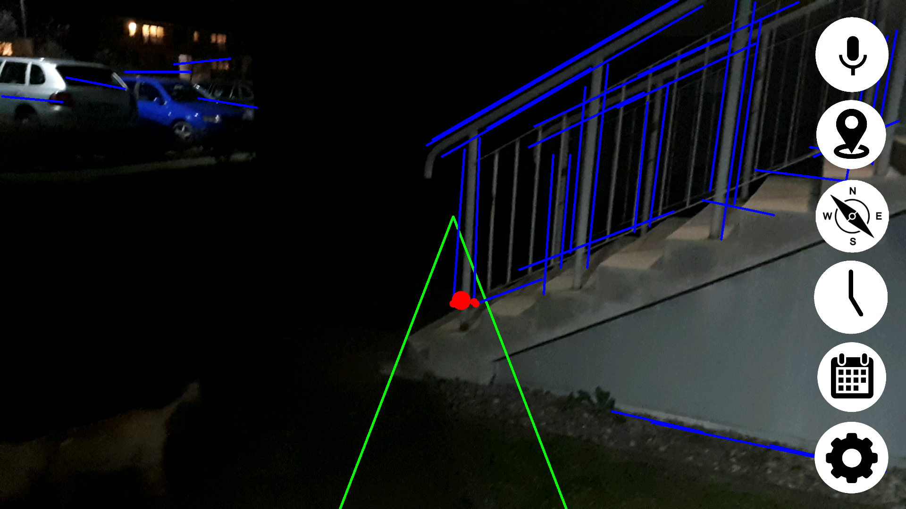

# Navigation For Blind
This application is part of my engineering thesis called "Mobile application for blind people to help them navigate through the city". 

## Features
- obstacle detection with OpenCV (stereo 3d sounds with a change in amplitude depending on estimated distance to an object)
- current location (address)
- compass
- date and hour
- voice commands
- compatible with Android ScreenReader
- all features are conveyed verbally with speech synthesizer
- Polish and English language version

## The obstacle detection algorithm:
 1. Transform RGB to Gray image.
 2. Reduce image size to around 500x400. (the bigger the better results but worse performance)
 3. Apply median filter 5x5.
 4. Apply avg blur filter 5x5.
 5. Dilation 5x5- enlargment of brighter pixels and shrinking of darker ones. It serves a role of erasing dark edges occuring on the pavement between paving blocks.
 6. Apply median filter 5x5.
 7. Canny edge detection with adaptive min and max thresholds according to average image brightness -> Min=(1-0.33)*avg, Max=(1+0.33)*avg
 8. Probabilistic Hough Lines transform for lines detection. rho: 1.0, theta: Math.PI / 180, threshold: 40, minLineLength: 40.0, maxLineGap: 10.0)
 9. Detecting intersections between detected obstacle lines and our field of detection.
 10. Average closest intersection point from last frame and current frame.
 11. Make stereo sound (depending on intersection position left and right headphone volume is adjusted accordingly) with loudness according to relative distance to nearest intersection (the higher the intersection occurred on the screen the further it should be)

*(Warning) The algorithm does not include object classification or any other machine learning approach. Just pure openCV*

## Algorithm visualisation:

###### Convert to gray image.

###### After median and avg blur 5x5.

###### Dilation 5x5 (you can see the pavement dark edges disappear).

###### Canny edge detection.

###### Prob Hough lines.

## Now some of the results:

## Conclusion

The algorithm is based on assumption that obstacles have straight lines. If there is a circular obstacle like a ... huge ball (?) it won't be detected by this. Cars with curvy and soap like shapes are also not easy to detect. Hard shadows also can be mistaken for an obstacle. Pavement with colorful patterns also can disrupt the detection. Other than that the algorthim works quite well for detecting sidewalk posts, people, cars with sharp edges, pavement with well established edges without overgrowing grass, benches etc. It works in different lighting conditions thanks to adaptive canny thresholds, tho at night it has it's limitations. 
